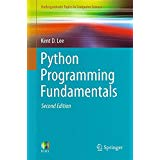
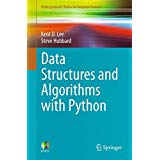
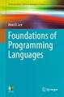

.. Pages of Kent D. Lee master file, created by
   sphinx-quickstart on Fri Aug 24 14:15:51 2018.
   You can adapt this file completely to your liking, but it should at least
   contain the root `toctree` directive.

The Pages of Kent D. Lee
================================================

Hello!
--------

.. figure:: _static/kent200.jpg
	:align: right

Welcome to Luther College and the Computer Science Department, the home of both Computer Science and
Data Science programs! I welcome visitors.
If you need to see me please consult my calendar for my office hours. If my office hours
don't work, then email me with a time that will work but consult my calendar to see when
I am free first. And, don't hesitate to just stop by. I am available most anytime I am not
in class between 8:30 and 3:30pm. If needed, I am happy to schedule appointments outside
my normal office hours.

| **Kent D. Lee, PhD, Department Chair**
| **Professor of Computer Science**
| **Luther College**

+--------+---------------------+
| office |       Olin 318      |
+--------+---------------------+
| phone  | 563-387-2429        |
+--------+---------------------+
| email  | kentdlee@luther.edu |
+--------+---------------------+

Interested in Learning to Program?
------------------------------------

It's never too early to learn to program. My experience has shown me that students
as early as elementary age can learn to program. They really enjoy it. But it's not
too late to start in college or even after college either!

I have written several textbooks and other curricula for Computer Science. They are listed below along with
links to supplementary files that go along with the texts.

Introduction to Programming
++++++++++++++++++++++++++++++

My `introductory text for computer programming <https://www.amazon.com/Programming-Fundamentals-Undergraduate-Computer-Science/dp/1447166418/ref=sr_1_2?ie=UTF8&qid=1535166521&sr=8-2&keywords=kent+lee+python>`_
focuses on Python programming. It introduces programming to
people with no previous experience in programming. In support of this text I have produced lectures that
are available for free on Youtube. These videos have been very popular with people learning to program. The last I
checked there were a half million views of them and I have over 3,300 subscribers. You can find the `playlist for these
videos by clicking here <https://www.youtube.com/playlist?list=PL1DE477438120C9EF>`_. `You can access the supplementary
materials for this textbook by clicking here <http://knuth.luther.edu/~leekent/IntroToComputing>`_.

.. figure:: _static/frogger.gif
	:align: right

I have also written a very concise (meaning dense and more intense) introduction to Python programming through the development
of computer games - both 2D video games and board games. The online text focuses on learning to program first, followed by an
introduction to programming 2D graphics video games using Turtle Graphics and PyGame. Then it moves on to Artificial Intelligence topics like building
computer opponents for games of perfect information. Finally it concludes with an introduction to Machine Learning
and the Alpha Go Zero algorithm for teaching a neural net to play a game of perfect information (like Go, Chess,
Connect Four, Checkers, or Tic Tac Toe) without any expertise from a human and with no human interaction. Alpha Go Zero
builds extremely strong computer opponents by playing games itself and *teaching* itself to play a game.
`You can find this free online textbook by clicking here <https://kentdlee.github.io/SCSI/build/html/index.html>`_.

There are two other resources that I have written for introductory programming. The site `Sampling CS for Middle and
High School Students <http://knuth.luther.edu/~leekent/SamplingCS>`_ contains some teaching materials that are
appropriate, and *fun*, for teaching high school and middle school students.

I have also created a sequence of videos for building the game of Frogger. This `playlist contains the full set of
Python Programming by Example <https://www.youtube.com/watch?v=5Sa-s_Bd7mE&list=PL8tLy_7ToXL9-Z_5GoWI_01-op8SeyN2E>`_ videos.
The `Frogger GitHub repository contains the code examples <http://github.com/kentdlee/Frogger>`_ that go along with
this series of lessons.

Data Structures and Algorithms
++++++++++++++++++++++++++++++++

With Dr. Steve Hubbard, Professor Emeritus at Luther College, I have written a textbook on `Data Structures and
Algorithms with Python <https://www.amazon.com/Structures-Algorithms-Undergraduate-Computer-Science/dp/3319130714/ref=sr_1_1?ie=UTF8&qid=1535166422&sr=8-1&keywords=kent+lee+data+structures>`_
as the programming language. This text contains the traditional second course in Computer
Science topics along with Advanced Data Structures topics that are appropriate for a third or fourth year Computer
Science undergraduate course. The text focuses on many data structures including Stacks, Queues, Heaps, Priority
Queues, Hashtables for sets and maps, and balanced search trees including AVL Trees, Splay Trees, and B-Trees.
It also includes search and sorting algorithms and heuristic search algorithms. The text addresses computational
complexity of algorithms throughout by teaching you how to recognize and analyze algorithms to determine the
behavior as the size of the data grows in an application. `You can access the supplementary materials for this
text by clicking here <http://knuth.luther.edu/~leekent/CS2Plus>`_.

Foundations of Programming Languages
++++++++++++++++++++++++++++++++++++++

The implementation and specification of programming languages is an area that I really get excited about. I
have written a `textbook which focuses on the design and implementation of programming languages
<https://www.amazon.com/Foundations-Programming-Languages-Undergraduate-Computer/dp/3319707892/ref=sr_1_1?ie=UTF8&qid=1535151950&sr=8-1&keywords=kent+lee+programming>`_.
The text contains some theory mixed with various pieces of a programming language implementation. In addition, the text
introduces the reader to functional and logic programming.

You can get access to `support material for the textbook at this website <http://knuth.luther.edu/~leekent/PL/>`_.

The first part of the text introduces a virtual machine, called JCoCo, which supports a low-level programming
language and is based on the Python 3.2 virtual machine. In fact, JCoCo can execute disassembled Python 3.2 code.
You can find `JCoCo's website here <http://kentdlee.github.io/JCoCoPages>`_. There is a partial Java implementation
provided to students at `http://github.com/kentdlee/JCoCo <http://github.com/kentdlee/JCoCo>`_. A full version of
the JCoCo implementation is available to teachers.

The text also builds a compiler for a decent subset of Standard ML. The partial student version of this code
is provided at `http://github.com/kentdlee/MLComp <http://github.com/kentdlee/MLComp>`_. Again, a complete
version is available for teachers. The MLComp project includes a compiler from Standard ML to CoCo assembly language
and a type inference system written in Prolog. The complete version for teachers includes the full code for
both the compiler and the type inference system.

Quick Links
------------------------

	* `Python Programming Fundamentals Support Materials <http://knuth.luther.edu/~leekent/IntroToComputing>`_ has support materials for my introductory Python programming text.
	* `Data Structures and Algorithms with Python <http://knuth.luther.edu/~leekent/CS2Plus>`_ has support materials for the data structures text.
	* `Foundations of Programming Languages <http://knuth.luther.edu/~leekent/PL>`_ has support materials for the programming languages text.
	* `Computer Science Writing Requirement Guidelines <http://knuth.luther.edu/~leekent/stories/luther-cs-writing-requirement.html>`_ provides the requirements for completing CS296 which must be taken in conjunction with one CS course numbered 300 or above.
	* `The CoCo VM <http://knuth.luther.edu/~leekent/CoCo>`_ is a virtual machine based on Python that also features a Python disasssembler. This is the older C++ version. The newer version is written in Java and is called `JCoCo <http://github.com/kentdlee/JCoCo>`_.
	* `The MLComp Project on GitHub <http://github.com/kentdlee/MLComp>`_ is a Standard ML compiler that targets the CoCo VM. It includes a compiler implemented in Standard ML and a type inference system for Standard ML which is implemented in Prolog.
	* `My Publications and Other Projects <publications.html>`_ contains a list of papers I have presented and textbooks I have published along with a description of my current projects. You can download many of the papers from this page.
	* `Sampling CS for Middle and High School Students <http://knuth.luther.edu/~leekent/SamplingCS>`_ contains some teaching materials that are appropriate, and *fun*, for teaching high school and middle school students.
	* `Building a Recursive Descent Parser <http://knuth.luther.edu/~leekent/tutorials/ll1.html>`_ is a widely referenced tutorial on building a recursive descent parser.
	* `Programming Languages: An Active Learning Approach Support Materials <http://knuth.luther.edu/~leekent/ProgrammingLanguages>`_. This is the old textbook. Look for the new one coming out spring of 2015.

.. toctree::
   :maxdepth: 2
   :caption: Contents:

Indices and tables
==================

* :ref:`genindex`
* :ref:`modindex`
* :ref:`search`
